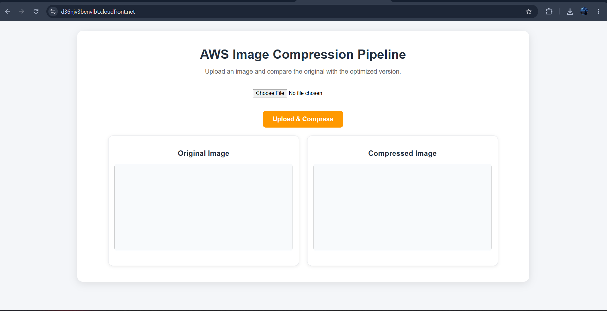
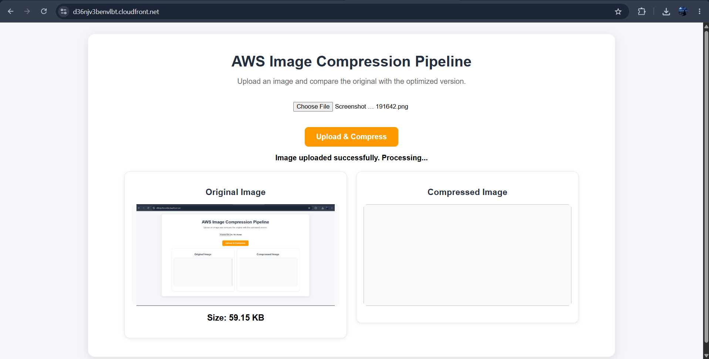
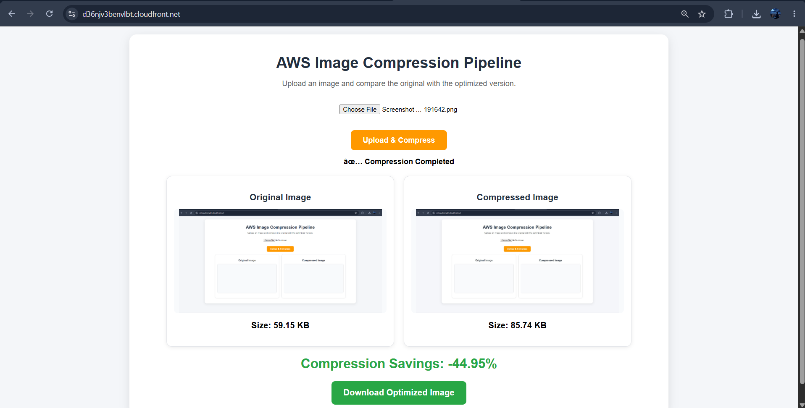

# AWS Image Compression Pipeline



## Overview

AWS Image Compression Pipeline is a fully serverless web application that allows users to upload images, automatically compress them using AWS services, compare original and compressed versions, and securely download optimized images.

The project leverages AWS Lambda, Amazon S3, API Gateway, and CloudFront to provide an event-driven image processing workflow with a responsive web interface.

---

## Live Demo

https://d36njv3benvlbt.cloudfront.net/

---

## Project Highlights

* Built a fully serverless image compression solution on AWS.
* Implemented event-driven processing using Amazon S3 and AWS Lambda.
* Hosted frontend using Amazon S3 and Amazon CloudFront.
* Enabled secure image downloads using Presigned URLs.
* Developed responsive web interface for desktop and mobile users.
* Automated image compression workflow with minimal infrastructure management.
* Displayed original and compressed image comparison with compression statistics.

---

## Architecture


### Architecture Flow

```text
User
  ↓
CloudFront
  ↓
S3 Static Website Hosting
  ↓
API Gateway
  ↓
Upload Lambda
  ↓
Input S3 Bucket
(manoj-image-input-2026)
  ↓
Compression Lambda
  ↓
Output S3 Bucket
(manoj-image-output-2026)
  ↓
Presigned URL Download
  ↓
User
```

---

## Output / Results

The application successfully compresses uploaded images while maintaining visual quality and provides secure downloads using AWS Presigned URLs.

### Application Home Page


### Image Upload and Processing



### Compression Result and Download



### Sample Compression Result

| Metric                | Value             |
| --------------------- | ----------------- |
| Original Image Size   | 331 KB            |
| Compressed Image Size | 128 KB            |
| Storage Reduction     | 61.20%            |
| Download Method       | AWS Presigned URL |
| Deployment            | CloudFront + S3   |

---

## AWS Services Used

### Amazon S3

* Frontend hosting
* Input image storage
* Output image storage

### AWS Lambda

* Image upload API
* Image compression processing

### Amazon API Gateway

* REST API endpoint for image uploads and downloads

### Amazon CloudFront

* Global content delivery
* HTTPS support
* Frontend acceleration

### Amazon CloudWatch

* Lambda monitoring
* Logging and troubleshooting

---

## Project Workflow

### Step 1 – Image Upload

Users upload images through the web interface.

### Step 2 – API Processing

API Gateway receives the request and invokes the Upload Lambda function.

### Step 3 – Store Image

Upload Lambda stores the image in the Input S3 Bucket.

### Step 4 – Automatic Compression

An S3 event triggers the Compression Lambda function.

### Step 5 – Generate Optimized Image

Compression Lambda compresses the image and stores it in the Output S3 Bucket.

### Step 6 – Secure Download

The application generates a Presigned URL and allows users to securely download the optimized image.

---

## Project Structure

```text
AWS-Image-Compression-Pipeline/
│
├── frontend/
│   ├── index.html
│   └── style.css
│
├── lambda/
│   ├── image-upload-api.py
│   └── image-compression.py
│
├── docs/
│   └── architecture.png
│
├── screenshots/
│   ├── home-page.png
│   ├── upload-success.png
│   └── compression-result.png
│
└── README.md
```

---

## Technology Stack

### Frontend

* HTML5
* CSS3
* JavaScript

### Backend

* Python

### Cloud Services

* Amazon S3
* AWS Lambda
* API Gateway
* Amazon CloudFront
* Amazon CloudWatch

---

## Security Features

* Private image storage buckets
* Secure Presigned URL downloads
* HTTPS access through CloudFront
* Serverless event-driven architecture
* Controlled access to image resources

---

## Key Learning Outcomes

* AWS Serverless Architecture
* Event-Driven Processing
* S3 Event Notifications
* API Gateway Integration
* CloudFront Deployment
* Image Optimization Techniques
* Frontend and Backend Integration
* Secure File Delivery using Presigned URLs

---

## Future Enhancements

* Support for multiple image formats
* User authentication and authorization
* Drag-and-drop image uploads
* Compression quality selection
* Batch image compression
* Compression history dashboard
* Image metadata analytics

---

## Author

### Konireddy Manoj Kumar Reddy

LinkedIn:
https://www.linkedin.com/in/manoj-konireddy

GitHub:
https://github.com/manoj-konireddy
